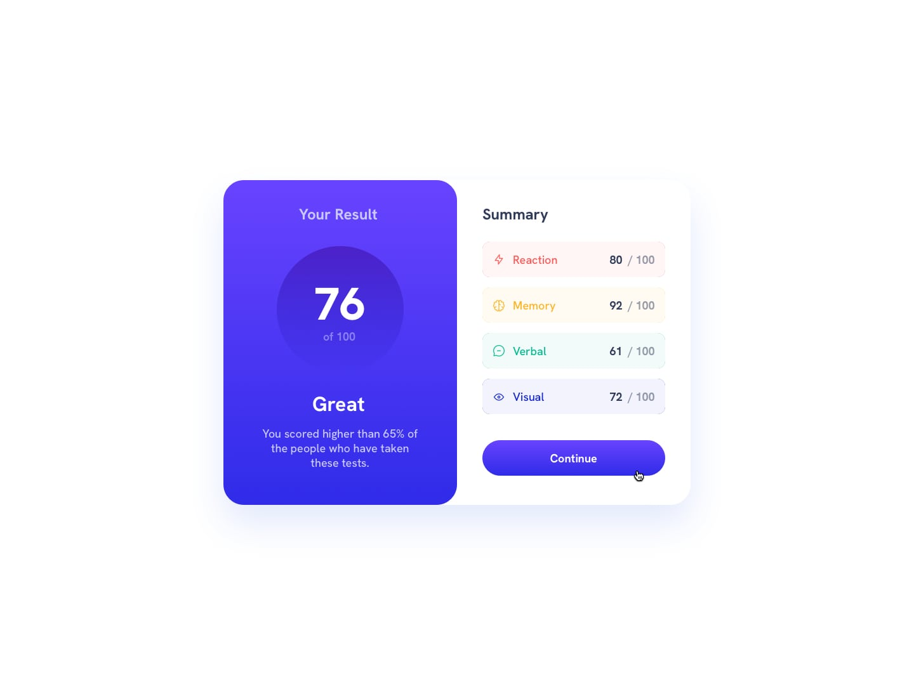

# Project Desc

In this project, I will explain how to make a PNG image responsive using Next.js and Styled CSS, starting with a PNG image we have on hand.

## How to Use?

Clone the local copy of the project:

```bash
git clone https://github.com/username/project-name.git
cd project-name
```

Install the required dependencies:

```bash
npm install
# or
yarn install
```

Run the application:
```bash
npm run dev
# or
yarn dev
```

# Visual Example
Below, you'll find a visual comparison between the original image we have and the result of the project.

# Original Images
• Normal

• Active

• Responsive


# Result Images
• Normal

• Active

• Responsive


# Technologies Used
The primary technologies used in this project are:

• Next.js
• TypeScript
• Styled CSS

# Contributing
If you'd like to contribute to the project, please create a pull request. Your contributions are welcome.

# License
No LICENSE